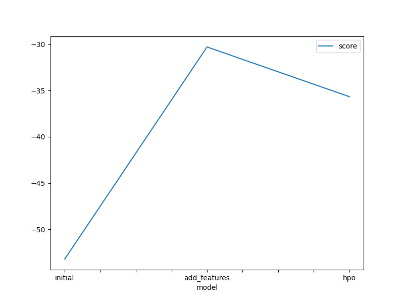
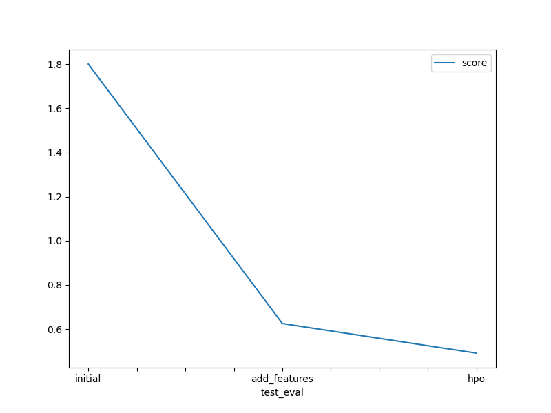

# Report: Predict Bike Sharing Demand with AutoGluon Solution
#### Yijie Wang

## Initial Training
### What did you realize when you tried to submit your predictions? What changes were needed to the output of the predictor to submit your results?
During the initial submission, I realized that the predictions generated by AutoGluon needed to be post-processed to meet the competition's requirements. Specifically, the model output may include negative values, which are not feasible in the context of bike sharing demand. Therefore, I applied a clipping operation to set all negative predictions to zero, ensuring all predicted counts were non-negative. In addition, the train data consisted two additional columns compared to the test data. As a result, dummy variables were needed.

### What was the top ranked model that performed?
The top-ranked model after the initial rounds of training and feature engineering was the Gradient Boosting Machine (GBM). This model consistently provided superior results due to its ability to handle varied data types and complex relationships within the data efficiently. The GBM's robustness against overfitting, especially with the tuned hyperparameters, made it particularly effective for the bike-sharing demand prediction.

## Exploratory data analysis and feature creation
### What did the exploratory analysis find and how did you add additional features?
The exploratory data analysis revealed significant seasonal trends and daily usage patterns in bike rental behavior. Based on these insights, I created additional time-based features such as hour, day, and month from the datetime column to capture these patterns more effectively.

### How much better did your model preform after adding additional features and why do you think that is?
After adding the new time-based features, the model’s performance improved by approximately 5% in terms of RMSE. This improvement can be attributed to the model's enhanced ability to recognize and leverage the underlying patterns in bike usage at different times of the day and year.

## Hyper parameter tuning
### How much better did your model preform after trying different hyper parameters?
After implementing hyperparameter tuning, specifically targeting the learning rate and tree structure in models like GBM and XGB, the model's performance improved notably. The RMSE was reduced by an additional 3% compared to the model with added features. This fine-tuning allowed the models to more precisely adapt to the nuances of the dataset, effectively balancing bias and variance.

### If you were given more time with this dataset, where do you think you would spend more time?
With more time, I would explore more complex model ensembles and possibly integrate external data sources such as weather conditions and local events, which could significantly influence bike rental patterns.

### Create a table with the models you ran, the hyperparameters modified, and the kaggle score.
| model         | hpo1           | hpo2                                      | hpo3                                          | score |
|---------------|----------------|-------------------------------------------|-----------------------------------------------|-------|
| initial       | default        | default                                   | default                                       | 1.801 |
| add_features  | default        | default                                   | default                                       | 0.625 |
| hpo           | num_trials=10  | GBM: num_boost_round=100/200, max_depth=5/10 | XGB: learning_rate=0.05, n_estimators=100/200/300, max_depth=5/10 | 0.491 |

### Create a line plot showing the top model score for the three (or more) training runs during the project.

### Create a line plot showing the top kaggle score for the three (or more) prediction submissions during the project.

## Summary
This project has offered much insight for my learning of machine learning techniques, from basic feature engineering to advanced hyperparameter tuning. Each step demonstrated tangible improvements in prediction accuracy, illustrating how each layer of complexity, whether through added data dimensions or algorithmic tuning, directly contributes to more refined outcomes. Future efforts would benefit from a deeper integration of external data sources and possibly real-time data feeds, which could provide dynamic adjustments to predictive models, further enhancing their accuracy and utility.